# Architektur-Bericht – Garten Dienstplan

Stand: 2026-09-23 · Grundlage: Code-Stand nach Commit `31e23ac` und Migrationen `001`–`023`.

Dieses Dokument beschreibt, wie die App aufgebaut ist, wie Daten fließen und warum Dinge so gelöst sind.
Es richtet sich an Betreiber ohne tiefe Entwicklerkenntnisse, bleibt aber technisch präzise. Jede Aussage
verweist auf die Datei, in der das Verhalten umgesetzt ist.

---

## Inhalt

1. [Überblick, Ziele, Tech-Stack, Deployment](#1-überblick-ziele-tech-stack-deployment)
2. [Systemkontext](#2-systemkontext)
3. [Schichtenmodell und Verzeichnisstruktur](#3-schichtenmodell-und-verzeichnisstruktur)
4. [Request- und Datenfluss](#4-request--und-datenfluss)
5. [Authentifizierung und Rollen](#5-authentifizierung-und-rollen)
6. [Datenmodell](#6-datenmodell)
7. [Aufgaben-Lebenszyklus](#7-aufgaben-lebenszyklus)
8. [Fairness und Planung](#8-fairness-und-planung)
9. [Cron-Job](#9-cron-job)
10. [Mitbewohner-Wechsel und Team-Abrechnung](#10-mitbewohner-wechsel-und-team-abrechnung)
11. [Benachrichtigungen](#11-benachrichtigungen)
12. [Querschnittsthemen: Sicherheit, Fehler, Zeitzonen, Tests, Migrationen, Grenzen](#12-querschnittsthemen)

---

## 1. Überblick, Ziele, Tech-Stack, Deployment

### Was die App tut

Ein Haushalt (meist eine Hausgemeinschaft) teilt sich einen Garten. Die App verteilt die Gartendienste
(Rasen mähen, Hecke schneiden, Laub, Schnee …) fair auf die Bewohner, erinnert an fällige Dienste,
erlaubt Übernahmen und Abwesenheiten und rechnet am Ende des Jahres geleistete Arbeit und Auslagen in Geld ab.

Kernprinzipien (siehe `CLAUDE.md`):

- **Single-Garden-Modell:** Ein Nutzer gehört zu genau einem Garten. `getCurrentGarden()` nimmt einfach den
  ältesten sichtbaren Garten (`src/lib/gardens/queries.ts`).
- **Punkte = Fairness.** Punkte werden nie gespeichert, sondern immer aus erledigten Aufgaben berechnet
  (`calculateScores` in `src/lib/tasks/queries.ts`).
- **Wartbar für Nicht-Entwickler:** keine eigene Server-Infrastruktur, nur Vercel + Supabase, keine UI-Bibliotheken.

### Tech-Stack

| Schicht | Technologie | Nachweis |
|---|---|---|
| Framework | Next.js 15 (App Router), React 19 | `package.json` |
| Sprache | TypeScript strict | `tsconfig.json` |
| Styling | Tailwind CSS 4 (arbitrary values), eigene Fonts via `next/font` | `src/app/layout.tsx`, `src/app/globals.css` |
| Datenbank | Supabase PostgreSQL mit Row Level Security | `supabase/migrations/*.sql` |
| Auth | Supabase Auth (Magic Link, E-Mail + Passwort) | `src/components/auth/login-form.tsx` |
| Realtime | Supabase Realtime (nur Chat) | `supabase/migrations/014_garden_chat.sql`, `src/components/chat/chat-view.tsx` |
| Push | Web Push mit VAPID (`web-push`), Service Worker | `src/lib/notifications/web-push.ts`, `public/sw.js` |
| Wetter | WetterOnline (HTML-Scraping) mit Open-Meteo-Fallback | `src/lib/weather/wetteronline.ts` |
| Optional | Telegram-Bot | `src/lib/notifications/telegram.ts` |
| Tests | Node Test Runner (`node --test --experimental-strip-types`) | `package.json`, `tests/` |

### Deployment

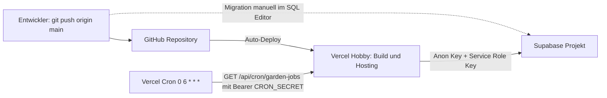

- **Code:** Jeder Push auf `main` löst über die GitHub-Integration einen Vercel-Build aus (`.claude/rules/05-git.md`).
- **Datenbank:** Migrationen werden **manuell** im Supabase SQL Editor ausgeführt – vor oder gleichzeitig mit dem Code-Deploy.
- **Cron:** `vercel.json` definiert genau einen Job: `"/api/cron/garden-jobs"` mit `"0 6 * * *"` (täglich 06:00 UTC = 07:00/08:00 Uhr deutscher Zeit).

Umgebungsvariablen (alle im Code per `process.env` gelesen):

| Variable | Zweck | Geheim? |
|---|---|---|
| `NEXT_PUBLIC_SUPABASE_URL`, `NEXT_PUBLIC_SUPABASE_ANON_KEY` | Supabase-Zugang für Browser und Server (RLS schützt) | nein |
| `SUPABASE_SERVICE_ROLE_KEY` | Admin-Client ohne RLS (Cron, einige Server Actions) | **ja** |
| `CRON_SECRET` | Schützt die Cron-Route | **ja** |
| `NEXT_PUBLIC_WEB_PUSH_VAPID_PUBLIC_KEY`, `WEB_PUSH_VAPID_PRIVATE_KEY`, `WEB_PUSH_VAPID_SUBJECT` | Web Push | privater Key **ja** |
| `NEXT_PUBLIC_SITE_URL` | Basis-URL für Magic-Link-Redirects (`src/lib/app-url.ts`) | nein |
| `TELEGRAM_BOT_TOKEN` | optionaler Telegram-Versand | **ja** |
| `WETTERONLINE_LOCATION` | Standard-Wetterort, falls der Garten keinen hat | nein |

---

## 2. Systemkontext

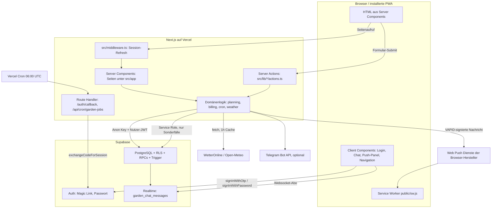

Wichtig: Der Browser spricht nur für **Login** (`src/lib/supabase/client.ts`) und **Chat-Realtime** direkt mit
Supabase. Alle anderen Lese- und Schreibzugriffe laufen über den Next.js-Server.

---

## 3. Schichtenmodell und Verzeichnisstruktur

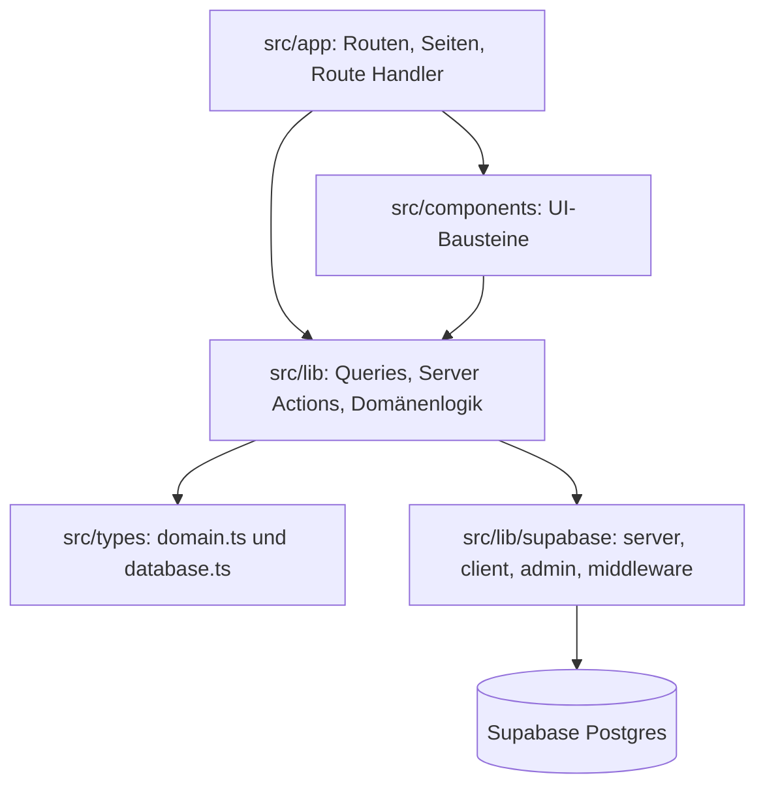

| Ordner | Inhalt | Regeln |
|---|---|---|
| `src/app/` | 15 Seiten (`page.tsx`), `layout.tsx`, `loading.tsx` (Mäher-Animation), `manifest.ts` (PWA), Route Handler `auth/callback/route.ts` und `api/cron/garden-jobs/route.ts` | Alle Datenseiten haben `export const dynamic = "force-dynamic"` |
| `src/components/` | Nach Feature gruppiert: `auth`, `availability`, `calendar`, `chat`, `dashboard`, `help`, `layout`, `members`, `settings`, `tasks`, `ui` | Server Components als Standard |
| `src/lib/` | Pro Domäne `queries.ts` (lesend) und `actions.ts` (Server Actions), dazu reine Logik (`planning/*`, `billing/teams.ts`, `format/*`, `weather/*`) | Server Actions beginnen mit `"use server"` und `requireUser()` |
| `src/types/` | `domain.ts` (App-Typen), `database.ts` (Supabase-Tabellen und RPC-Signaturen) | kein `any` |
| `supabase/` | Migrationen `001`–`020`, `seed.sql` (8 globale Vorlagen) | additiv, idempotent |
| `public/` | `sw.js` (Push-Service-Worker), `icon.svg` | – |
| `tests/` | `unit/*.test.mjs`, `integration/*.test.mjs` | Node Test Runner |

### Seiten (Routen)

| Route | Zweck |
|---|---|
| `/` | Redirect auf `/dashboard` (`src/app/page.tsx`) |
| `/login` | Login-Formular |
| `/auth/callback` | Tauscht den Magic-Link-Code gegen eine Session, validiert `next` gegen offene Redirects |
| `/dashboard` | Garten anlegen (wenn keiner), Aufgabenfilter, Punkte-Rennen, Owner-Recovery, manuelle Chat-Erinnerungen (Admin) |
| `/tasks`, `/tasks/new`, `/tasks/[id]` | Aufgabenliste, Neu/Nachtrag, Detail mit Kommentaren, Übernahme, Verlauf |
| `/calendar` | Monatskalender mit echten Aufgaben, Forecast-Vorschlägen (gestrichelt), Abwesenheiten, Wetter |
| `/forecast` | 3-Monats-Vorschau, Einloggen von Vorschlägen |
| `/chat` | Gruppenchat mit @Mentions und Systemnachrichten |
| `/billing` | Team-Abrechnung, Buchungen, Ausgleiche, Abschluss, Archiv |
| `/notifications` | In-App-Meldungen |
| `/settings/members` | Mitglieder, Einladungen, vorab anlegen, Auszug |
| `/settings/garden` | Name, Chat-Aufbewahrung, Wetterort, Abwesenheiten, Push, Telegram, Verlassen/Löschen |
| `/templates` | Aufgabenvorlagen und Zeitpläne |
| `/log` | Zentraler Aktions-Verlauf aus `task_events` (letzte 200) |
| `/help` | Bedienhilfe nach Rolle mit Suche (`src/lib/help/content.ts`) |
| `/install` | PWA-Installationsanleitung |
| `/invite/[token]` | Einladung annehmen |

### Server- vs. Client Components

Standard ist die Server Component: Sie liest Daten direkt mit dem Server-Client und liefert fertiges HTML.
Nur diese Dateien tragen `"use client"` – jeweils mit zwingendem Grund:

| Datei | Grund |
|---|---|
| `src/components/auth/login-form.tsx` | Formular-State, Browser-Supabase-Client für `signInWithOtp` / `signUp` / `signInWithPassword`, `useRouter` |
| `src/components/chat/chat-view.tsx` | Realtime-Abo (`postgres_changes`), lokaler Nachrichten-State, Auto-Scroll, markiert Chat als gelesen |
| `src/components/chat/chat-input.tsx` | @Mention-Autovervollständigung, Eingabe-State |
| `src/components/settings/web-push-panel.tsx` | `navigator.serviceWorker`, `PushManager`, iOS-/PWA-Erkennung |
| `src/components/layout/mobile-menu.tsx` | `usePathname` für aktiven Tab, Auf-/Zuklappen des Menüs |
| `src/components/help/help-browser.tsx` | Live-Suche in den Hilfetexten |
| `src/components/ui/button.tsx` | `useFormStatus` für Lade-Spinner während eine Server Action läuft |
| `src/lib/supabase/client.ts` | Browser-Supabase-Client (nur Login und Realtime) |

`AppShell` (`src/components/layout/app-shell.tsx`) ist eine Server Component: Sie lädt Garten, ungelesene
Chat-Nachrichten und Meldungen und reicht die Navigation an die Client-Komponente `mobile-menu.tsx` weiter.

### Supabase-Clients

| Client | Datei | Einsatz |
|---|---|---|
| Server-Client (Cookie-Session, RLS aktiv) | `src/lib/supabase/server.ts` | Server Components und Server Actions |
| Browser-Client | `src/lib/supabase/client.ts` | Login, Chat-Realtime |
| Middleware-Client | `src/lib/supabase/middleware.ts` | Session-Refresh (`updateSession`) |
| Admin-Client (service_role, **ohne RLS**) | `src/lib/supabase/admin.ts` | Cron und ausgewählte Server Actions (siehe Abschnitt 12) |

---

## 4. Request- und Datenfluss

### 4a. Seitenaufruf mit Session

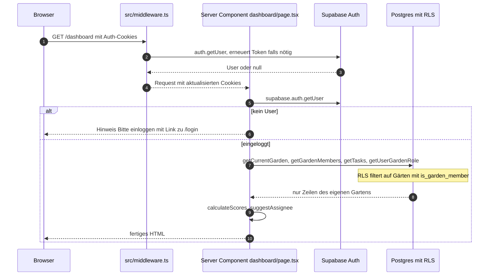

Hinweise:
- Die Middleware leitet **nicht** um, sie erneuert nur die Session (`src/lib/supabase/middleware.ts`). Der Schutz
  erfolgt pro Seite (`auth.getUser()` + Hinweis) und in jeder Server Action (`requireUser()` → `redirect("/login")`).
- Server Components dürfen keine Cookies schreiben; der `try/catch` in `src/lib/supabase/server.ts` fängt das ab.
  Deshalb übernimmt die Middleware (`src/middleware.ts`) den Token-Refresh bei jedem Seitenaufruf.

### 4b. Server Action: „Dienst erledigt“

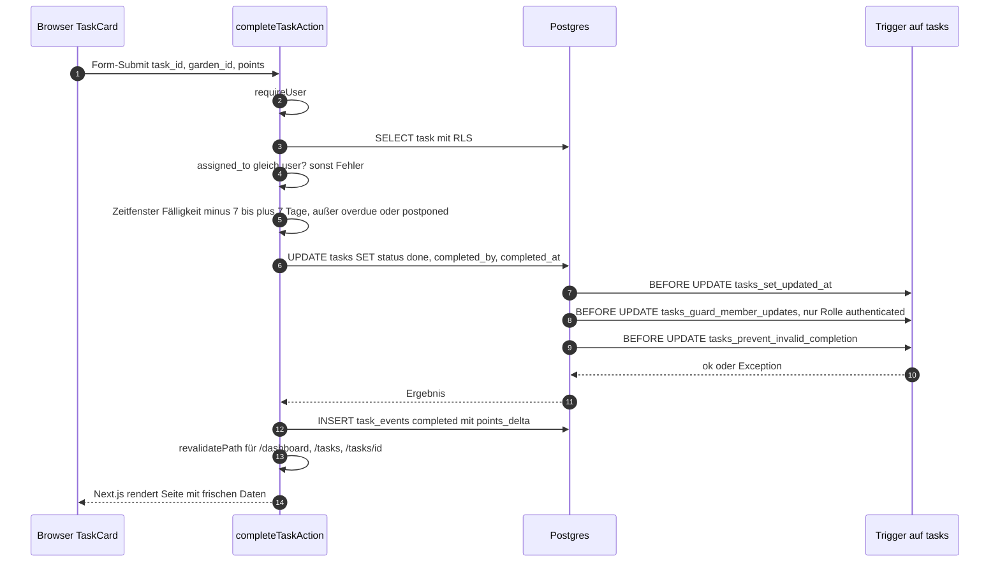

Die Prüfungen sind doppelt: in der Action (`src/lib/tasks/actions.ts`, `src/lib/tasks/completion-window.ts`)
und in der Datenbank (`prevent_invalid_task_completion`, zuletzt ersetzt in `017_direct_task_completion.sql`):
Nur die zugewiesene Person darf erledigen, `completed_by`/`completed_at` müssen gesetzt sein, und außerhalb des
±7-Tage-Fensters geht es nur, wenn die Aufgabe `overdue`, `postponed` oder `pending_review` war. Zusätzlich
erzwingt ein Check-Constraint `(status = 'done') = (completed_at is not null)` (`001_initial_schema.sql`).

Allgemeines Muster jeder Mutation (`.claude/rules/01-architecture.md`):
`requireUser()` → Server-Client → Eingaben mit `readString` lesen und prüfen → optional Rollenprüfung
(`getUserGardenRole` + `canManageGarden` aus `src/lib/gardens/roles.ts`) → DB-Operation → `task_events` protokollieren →
Benachrichtigung → `revalidatePath()` → optional `redirect()`.

---

## 5. Authentifizierung und Rollen

### Login

> E-Mail-Versand: Supabase-Standard-SMTP (`noreply@mail.app.supabase.io`), nur für Tests gedacht (Rate-Limit, oft Spam).
> Empfehlung: eigenes SMTP (Brevo/Resend). `src/components/auth/login-form.tsx` übersetzt Auth-Fehler
> („Email not confirmed“, „Invalid login credentials“, Rate-Limit, „already registered“) ins Deutsche und bietet
> „Bestätigungs-Mail erneut senden“ (`auth.resend`). Liefert `signUp` direkt eine Session (Bestätigung deaktiviert),
> wird sofort weitergeleitet.

`src/components/auth/login-form.tsx` bietet drei Wege:
1. **Magic Link:** `signInWithOtp` mit `emailRedirectTo = <Site-URL>/auth/callback?next=…`.
2. **Registrieren:** `signUp` mit E-Mail + Passwort (Bestätigungsmail führt ebenfalls über `/auth/callback`).
3. **Passwort-Login:** `signInWithPassword`, danach `router.push(next)`.

`src/app/auth/callback/route.ts` tauscht den Code gegen eine Session und akzeptiert als `next` nur relative Pfade
(kein `//` oder `/\` → Schutz gegen offene Redirects). Beim ersten Login legt der Trigger `on_auth_user_created`
(`handle_new_user`, Migration 001) automatisch ein `profiles`-Profil an (Anzeigename aus Metadaten oder E-Mail-Präfix).

`src/lib/auth/session.ts`:
- `getUser()` – nutzt `supabase.auth.getUser()` (serverseitig validiert, nicht `getSession()`).
- `requireUser()` – wie oben, leitet ohne Login auf `/login` um. Erste Zeile jeder Server Action.

### Rollen

`garden_role` = `owner` | `admin` | `member` (Rang 3/2/1 über `role_rank`, Migration 004).

Seit Migration 023 haben **Admins dieselben Rechte wie Owner**. Der Owner unterscheidet sich nur noch darin, dass
jeder Garten mindestens einen aktiven Owner behalten muss (Trigger `prevent_last_owner_loss`) und dass der
Garten-Ersteller sich per `restore_garden_creator_owner` wieder zum Owner machen kann, falls keiner mehr aktiv ist.

| Aktion | Member | Admin | Owner | Durchgesetzt in |
|---|:-:|:-:|:-:|---|
| Aufgaben sehen, kommentieren | ✓ | ✓ | ✓ | RLS `tasks read members`, `task comments insert members` |
| Aufgabe anlegen (Punkte 1–5, Zuweisung frei oder fair) | ✓ | ✓ | ✓ | `createTaskAction`, RLS `tasks insert members` |
| Eigene Aufgabe erledigen | ✓ | ✓ | ✓ | `completeTaskAction` + Trigger |
| Übernahme anfragen / überfällige Aufgabe direkt übernehmen | ✓ | ✓ | ✓ | `requestTakeoverAction`, Policy aus 018 |
| Übernahme entscheiden | nur als aktuell Zugewiesener | ✓ | ✓ | `decideTakeoverAction`, RLS `task takeover update assignee or admins` |
| Eigene Zuweisung fixieren | ✓ | ✓ (alle) | ✓ (alle) | `lockTaskAssignmentAction`, Guard-Trigger |
| Fixierung lösen, Aufgabe wieder öffnen, in Papierkorb, wiederherstellen | – | ✓ | ✓ | App-Prüfung + Guard-Trigger 018 |
| Erledigte Aufgabe nachtragen | – | ✓ | ✓ | `createCompletedTaskAction` |
| „Fair neu zuweisen“, Vorlagen verwalten, Aufgaben aus Vorlagen erzeugen | – | ✓ | ✓ | `reassignOpenTasksAction`, `src/lib/templates/actions.ts` |
| Eigene Abwesenheit | ✓ | ✓ | ✓ | RLS `availability manage self` |
| Abwesenheiten anderer verwalten | – | ✓ | ✓ | RLS `availability manage admins` |
| Ausgabe/Zahlung buchen | ✓ | ✓ | ✓ | RLS `garden transactions create members` |
| Abrechnungseinstellungen, Ausgleiche, Abrechnung abschließen | – | ✓ | ✓ | `src/lib/billing/actions.ts`, RPC `close_billing_period` |
| Gartenname, Chat-Aufbewahrung, Wetterort | – | ✓ | ✓ | RLS `gardens update admins` |
| Einladen, Person vorab anlegen (Rolle admin/member) | – | ✓ | ✓ | RLS + `add_prepared_garden_member` |
| Owner einladen / Owner ersetzen / Owner-Rechte vergeben oder ändern | – | ✓ | ✓ | Guard-Trigger 018/019 (seit 023 Owner **und** Admin) |
| Mitglieder deaktivieren, Rollen ändern | – | ✓ | ✓ | `src/lib/gardens/member-actions.ts` + Trigger (letzter Owner geschützt) |
| Garten verlassen | ✓ | ✓ | ✓ (nicht letzter Owner) | RPC `leave_garden` + Trigger `prevent_last_owner_loss` |
| Garten löschen (mit Bestätigung „LOESCHEN“) | – | ✓ | ✓ | RPC `delete_garden` (seit 023 auch Admin) |
| Owner-Rolle wiederherstellen | nur Garten-Ersteller | | | RPC `restore_garden_creator_owner` |
| Chat schreiben, eigene Nachricht löschen | ✓ | ✓ | ✓ | RLS Chat-Policies (014) |
| Fremde Chat-Nachricht löschen | – | ✓ | ✓ | RLS `chat delete own or admin` |

Es gibt bewusst **keinen globalen Admin** und kein Master-Passwort. Rechte hängen immer an Supabase Auth + Gartenrolle.

### Verteidigung in mehreren Schichten

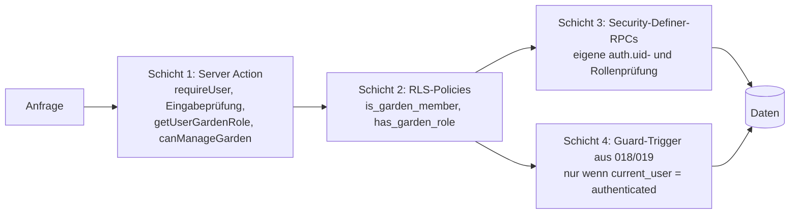

1. **Server Actions** prüfen Login, Eingaben und Rolle, bevor sie schreiben.
2. **RLS** ist auf allen Tabellen aktiv. Hilfsfunktionen `is_garden_member(garden_id)` und
   `has_garden_role(garden_id, roles[])` (Migration 001) prüfen jeweils `is_active = true`.
3. **Security-Definer-RPCs** für atomare, privilegierte Abläufe: `create_garden_with_owner`, `accept_garden_invite`,
   `restore_garden_creator_owner`, `leave_garden`, `delete_garden`, `add_prepared_garden_member`, `close_billing_period`.
   `replace_garden_member` ist eine interne Hilfsfunktion; `execute` ist für `authenticated` entzogen (019/020).
4. **Guard-Trigger** (Migration `018_harden_member_and_task_permissions.sql`) schließen Lücken, die ein Nutzer mit
   eigenem JWT direkt über die REST-API (PostgREST) an den Server Actions vorbei ausnutzen könnte:
   - `guard_garden_member_owner_changes`: Nur Owner und Admins (seit 023; vorher nur Owner) dürfen Owner-Rollen
     vergeben, ändern oder deaktivieren (Ausnahme: Garten-Ersteller legt sich selbst als Owner an).
   - `guard_member_task_updates`: Members dürfen Titel, Punkte, Fälligkeit usw. nicht ändern, fremde Aufgaben nur
     über Übernahme bekommen, nur eigene Aufgaben fixieren und nichts wieder öffnen oder stornieren.
   - Policy-Verschärfungen: Admins dürfen keine Owner-Einladungen erzeugen; Übernahme-Anfragen dürfen nur bei
     `overdue`/`postponed` direkt als `approved` angelegt werden.
   - `guard_invite_replacement` (019/023): „Ersetzt“ muss Mitglied desselben Gartens sein; einen Owner ersetzen dürfen Owner und Admins.

   Die Guard-Funktionen sind **security invoker** und prüfen `if current_user <> 'authenticated' then return …`.
   Dadurch greifen sie nur für normale Nutzeranfragen. Security-Definer-RPCs (laufen als Funktionseigentümer),
   der Cron und der Admin-Client (`service_role`) bleiben unberührt.

Zusätzlich schützt der Trigger `prevent_last_owner_loss` (Migrationen 005, korrigiert in 006) die Invariante
„jeder Garten hat mindestens einen aktiven Owner“ bei UPDATE und DELETE. Beim Kaskaden-Löschen eines Gartens
wird er übersprungen.

---

## 6. Datenmodell

Alle Tabellen liegen im Schema `public`, haben RLS und verweisen fast immer über `garden_id` mit `on delete cascade`
auf `gardens`. Nutzerbezüge zeigen auf `profiles(id)`, das wiederum 1:1 an `auth.users` hängt.

```mermaid
erDiagram
  profiles ||--o{ garden_members : "hat Mitgliedschaft"
  gardens ||--o{ garden_members : "hat Mitglieder"
  gardens ||--o{ garden_invites : "lädt ein"
  gardens ||--o{ tasks : "enthält"
  gardens ||--o{ task_templates : "eigene Vorlagen"
  task_templates |o--o{ tasks : "erzeugt"
  tasks ||--o{ task_comments : "hat"
  tasks |o--o{ task_events : "protokolliert"
  tasks ||--o{ task_takeover_requests : "Übernahmen"
  gardens ||--o{ availability : "Abwesenheiten"
  profiles ||--o{ availability : "ist abwesend"
  profiles ||--o{ notifications : "erhält"
  tasks |o--o{ notifications : "betrifft"
  profiles ||--o{ notification_contacts : "Kanäle"
  profiles ||--o{ web_push_subscriptions : "Geräte"
  gardens ||--o{ garden_chat_messages : "Chat"
  garden_chat_messages ||--o{ garden_chat_mentions : "erwähnt"
  gardens ||--o{ garden_transactions : "Buchungen"
  gardens ||--o| garden_billing_settings : "Stundensatz"
  gardens ||--o{ member_adjustments : "Ausgleiche"
  gardens ||--o{ billing_periods : "Zeiträume"
  profiles ||--o{ tasks : "zugewiesen oder erledigt"

  profiles {
    uuid id PK "= auth.users.id"
    text display_name
  }
  gardens {
    uuid id PK
    text name
    uuid created_by FK
    int chat_retention_days "Standard 90, 0 = nie"
    text weather_location
  }
  garden_members {
    uuid id PK
    uuid garden_id FK
    uuid user_id FK
    garden_role role
    boolean is_active
    timestamptz joined_at
    uuid slot_id "Platz bzw. Team"
    date joined_on
    date left_on
    uuid replaces_user_id "ohne FK seit 020"
    timestamptz last_chat_read_at
  }
  garden_invites {
    uuid id PK
    uuid garden_id FK
    text email
    garden_role role
    uuid token UK
    uuid created_by FK
    uuid accepted_by FK
    timestamptz accepted_at
    timestamptz expires_at "Standard 14 Tage"
    uuid replaces_user_id "ohne FK seit 020"
  }
  task_templates {
    uuid id PK
    uuid garden_id FK "null = global"
    text title
    int default_points
    int estimated_minutes
    int season_start_month
    int season_start_day
    int season_end_month
    int season_end_day
    recurrence_type recurrence_type
    int recurrence_interval
    int custom_interval_days
    boolean is_weather_dependent
    boolean is_active
  }
  tasks {
    uuid id PK
    uuid garden_id FK
    uuid template_id FK
    text title
    int points "1 bis 5"
    task_status status
    date due_date
    uuid assigned_to FK
    uuid original_assignee FK
    uuid completed_by FK
    timestamptz completed_at
    uuid created_by FK
    boolean assignment_locked
    uuid locked_by FK
  }
  task_events {
    uuid id PK
    uuid task_id FK "set null seit 009"
    uuid garden_id FK
    uuid actor_id FK
    task_event_type event_type
    uuid from_user_id FK
    uuid to_user_id FK
    int points_delta
    text note
  }
  task_comments {
    uuid id PK
    uuid task_id FK
    uuid garden_id FK
    uuid user_id FK
    text comment
  }
  task_takeover_requests {
    uuid id PK
    uuid task_id FK
    uuid garden_id FK
    uuid requested_by FK
    uuid current_assignee FK
    task_takeover_status status
    uuid decided_by FK
    text note
  }
  availability {
    uuid id PK
    uuid user_id FK
    uuid garden_id FK
    date from_date
    date to_date
    text reason
  }
  notifications {
    uuid id PK
    uuid user_id FK
    uuid garden_id FK
    text type
    text title
    text message
    uuid related_task_id FK
    timestamptz read_at
  }
  notification_contacts {
    uuid user_id PK
    uuid garden_id PK
    text whatsapp_phone
    text telegram_chat_id
    boolean telegram_enabled
    boolean in_app_enabled
  }
  web_push_subscriptions {
    uuid id PK
    uuid user_id FK
    uuid garden_id FK
    text endpoint
    text p256dh
    text auth
    boolean is_active
  }
  garden_chat_messages {
    uuid id PK
    uuid garden_id FK
    uuid author_id FK "null = System"
    text content "1 bis 2000 Zeichen"
    text message_type "user, system_reminder, system_overdue"
    uuid visible_to_user_id FK
    uuid related_task_id FK
  }
  garden_chat_mentions {
    uuid id PK
    uuid message_id FK
    uuid user_id FK
  }
  garden_transactions {
    uuid id PK
    uuid garden_id FK
    garden_transaction_type type "expense oder payment"
    text title
    int amount_cents
    uuid paid_by FK
    uuid paid_to FK
    date occurred_on
    uuid created_by FK
  }
  garden_billing_settings {
    uuid garden_id PK
    int hourly_rate_cents "Standard 1000"
    numeric point_hours "Standard 1"
  }
  member_adjustments {
    uuid id PK
    uuid garden_id FK
    uuid user_id FK
    int points_delta
    int amount_cents_delta
    text reason
    uuid created_by FK
  }
  billing_periods {
    uuid id PK
    uuid garden_id FK
    date starts_on
    date ends_on "null = offen"
    timestamptz closed_at
    uuid closed_by FK
    jsonb snapshot
  }
```

### Enums

| Enum | Werte | Migration |
|---|---|---|
| `garden_role` | owner, admin, member | 001 |
| `task_status` | open, assigned, done, overdue, cancelled, postponed, pending_review (Altlast) | 001, 010 |
| `recurrence_type` | none, weekly, monthly, seasonal, on_demand | 001 |
| `task_event_type` | created, assigned, reassigned, accepted, completed, reopened, postponed, cancelled, commented | 001 |
| `task_takeover_status` | pending, approved, rejected, cancelled | 007 |
| `garden_transaction_type` | expense, payment | 007 |

### Wichtige Constraints und Indizes

- `garden_members unique (garden_id, user_id)`; `billing_periods_one_open_idx`: genau ein offener Zeitraum je Garten (partieller Unique-Index, 019).
- `tasks`: `points between 1 and 5`, `(status = 'done') = (completed_at is not null)`.
- `task_events.task_id` ist seit 009 `on delete set null`, damit der Verlauf das Löschen einer Aufgabe überlebt.
- `web_push_subscriptions unique (user_id, garden_id, endpoint)`.
- `garden_members.replaces_user_id` und `garden_invites.replaces_user_id` haben seit 020 **keinen** Fremdschlüssel mehr.
  Grund: Die zweite Beziehung zu `profiles` machte das PostgREST-Embedding `profiles(...)` mehrdeutig (HTTP 300).
  Deshalb nutzt `getGardenMembers` explizit `profiles!garden_members_user_id_fkey(...)`.
- Trigger `gardens_create_initial_billing_period` (019) legt für jeden neuen Garten den ersten offenen Abrechnungszeitraum an.

### Migrations-Chronik

| Nr. | Inhalt |
|---|---|
| 001 | Grundschema, Enums, RLS, `is_garden_member`, `has_garden_role`, Profil-Trigger |
| 002 | `garden_invites`, erste `accept_garden_invite` |
| 003 | `create_garden_with_owner` |
| 004 | `role_rank`, kein Rollen-Downgrade beim Annehmen, `restore_garden_creator_owner` |
| 005 | `prevent_last_owner_loss` (mit DELETE-Bug) |
| 006 | Fix des DELETE-Zweigs, `leave_garden`, `delete_garden` |
| 007 | Übernahmen, Buchungen, Abrechnungseinstellungen, Erledigungsfenster-Trigger |
| 008 | `member_adjustments`, `notification_contacts` |
| 009 | Task-Löschrecht für Admins, persistente Events |
| 010 | Status `pending_review` (Prüfschritt, heute Altlast) |
| 011 | `web_push_subscriptions` |
| 012 | Fixierte Zuweisungen (`assignment_locked`) |
| 013 | Eigene Intervalle und tagesgenaue Saison für Vorlagen |
| 014 | Garten-Chat, Mentions, Realtime, `chat_retention_days` |
| 015 | `last_chat_read_at` |
| 016 | `weather_location` |
| 017 | Direkte Erledigung ohne Prüfung, Migration offener Prüfungen auf `done` |
| 018 | Guard-Trigger und verschärfte Policies |
| 019 | Plätze/Teams, Ein-/Auszug, `billing_periods`, Ersetzen, vorab angelegte Personen |
| 020 | Fixes zu 019: FK entfernt, Owner-Übergabe beim Ersetzen, Abschluss endet gestern, deutsche Zeit |
| 023 | Admins haben dieselben Rechte wie Owner (Owner-Rollen, Owner ersetzen, Garten löschen); Schutz „mindestens ein aktiver Owner“ bleibt |
| 022 | Admins dürfen Korrekturen löschen; Einladungen mit E-Mail gelten nur für genau diese E-Mail |
| 021 | Namen Ausgezogener bleiben sichtbar, „Garten verlassen“ markiert als ausgezogen statt zu löschen, Meldungen nur noch serverseitig für andere, erster Zeitraum beginnt beim frühesten Dienst |

---

## 7. Aufgaben-Lebenszyklus

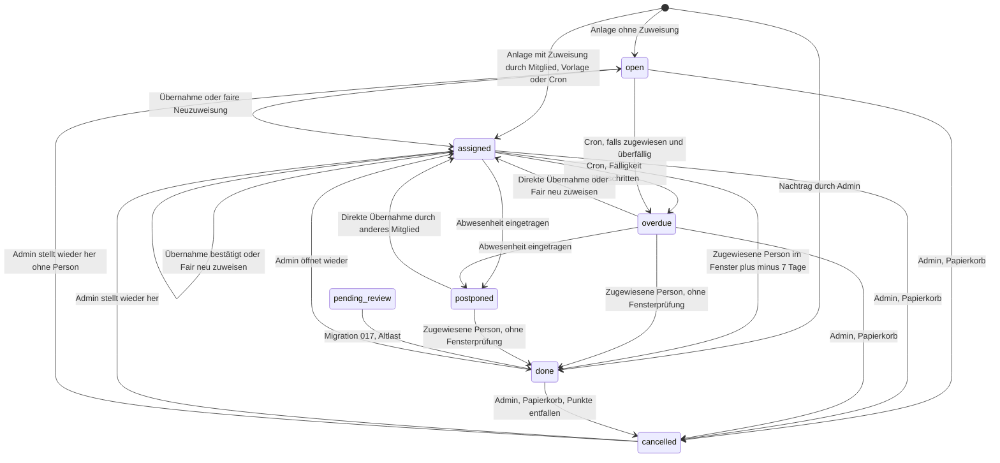

| Übergang | Auslöser | Code |
|---|---|---|
| Anlage `open`/`assigned` | jedes Mitglied; ohne gewählte Person schlägt `suggestAssignee` vor | `createTaskAction` |
| Anlage aus Vorlage | Admin per Knopf, täglich der Cron | `generateSeasonalTasksAction`, `runGardenAutomation` |
| Forecast einloggen (`assigned`, fixiert) | eigene Vorschläge: jedes Mitglied; alle: Admin | `lockForecastTaskAction` |
| → `overdue` | Cron (und manueller Knopf auf `/notifications`) | `src/lib/cron/garden-jobs.ts`, `src/lib/notifications/reminder-actions.ts` |
| → `postponed` | Mitglied trägt Abwesenheit ein, die eine eigene offene Aufgabe überdeckt | `createAvailabilityAction` (Admin-Client) |
| Übernahme | `pending`-Anfrage → Entscheidung durch Zugewiesenen/Admin; bei `overdue`/`postponed` sofort `approved` | `requestTakeoverAction`, `decideTakeoverAction` |
| → `done` | nur zugewiesene Person | `completeTaskAction` + Trigger |
| → `cancelled` (Papierkorb) | Admin; kein hartes Löschen, Event mit negativem `points_delta` | `deleteTaskAction` |
| wieder öffnen / wiederherstellen | Admin | `reopenTaskAction`, `restoreTaskAction` |
| Fixieren / Lösen | Zugewiesener oder Admin / nur Admin | `lockTaskAssignmentAction`, `unlockTaskAssignmentAction` |

`pending_review` stammt aus dem früheren Prüfschritt (Migration 010). Migration 017 hat ihn abgeschafft und offene
Prüfungen auf `done` gesetzt. Der Wert bleibt im Enum, weil Postgres Enum-Werte nicht additiv entfernen kann;
`StatusBadge` zeigt ihn noch als „Zur Prüfung“ an (`src/components/ui/status-badge.tsx`).

Jede Aktion schreibt ein `task_events`-Protokoll, das `/log` und die Aufgaben-Detailseite anzeigen.
Texte aus Titeln, Begründungen, Kommentaren und Chat laufen durch eine einfache Wortfilter-Prüfung
(`src/lib/moderation/content.ts`).

---

## 8. Fairness und Planung

### Bausteine

| Funktion | Datei | Aufgabe |
|---|---|---|
| `calculateScores(tasks, members, history)` | `src/lib/tasks/queries.ts` | Summiert Punkte erledigter (`done`) Aufgaben je aktivem Mitglied, merkt letzten Erledigungszeitpunkt, wendet dann `applyMembershipHistory` an, sortiert aufsteigend |
| `applyMembershipHistory` | `src/lib/planning/membership-scores.ts` | Nachfolger erbt Punkte der Vorgänger auf demselben Platz; zusätzliche Neuzugänge bekommen einen Startwert |
| `applyPointAdjustments` | `src/lib/adjustments/scores.ts` | Addiert manuelle Punkte-Ausgleiche (nur bei „Fair neu zuweisen“) |
| `suggestAssignee(scores, dueDate, availability)` | `src/lib/planning/fairness.ts` | Filtert Abwesende zum Fälligkeitsdatum, nimmt die Person mit den wenigsten Punkten; bei Gleichstand wer noch nie oder am längsten nicht dran war |
| `getCadenceRule`, `hasTemplateTaskWithinInterval`, `isTemplateDateInSeason` | `src/lib/planning/cadence.ts` | Intervalle und Mindestabstände je Kategorie, Doppel-Sperre, Saisonprüfung (auch über den Jahreswechsel) |
| `buildThreeMonthForecast` | `src/lib/planning/forecast.ts` | Simuliert Vorschläge für 3 Monate inkl. geplanter Last |

### Punkte-Anrechnung bei Mitgliederwechsel

- **Nachfolger** (gleicher `slot_id`, Vorgänger inaktiv): Nur das **neueste aktive** Mitglied des Platzes erhält
  die Summe der Punkte aller inaktiven Vorgänger. So bekommt der Neue nicht sofort alle Aufgaben.
- **Zusätzlicher Neuzugang** (eigener Platz, keine Vorgänger): Startwert =
  `round(Ø Punkte pro Tag aller anderen Mitgliedschaften × Tage zwischen erstem Beitritt im Garten und eigenem joined_on)`.
- Ohne Historie bleiben die Punkte unverändert.

Das Dashboard zeigt im Punkte-Rennen (`ScoreRace`) die **reinen** Punkte (`calculateScores(tasks, members)` ohne
Historie), der Fairness-Vorschlag nutzt dagegen die angerechneten Punkte (`src/app/dashboard/page.tsx`).

### Kadenz-Regeln (`src/lib/planning/cadence.ts`)

| Kategorie (Titel-Muster) | Intervall | Mindestabstand |
|---|---|---|
| Rasen (`rasen`, `mäh`, `mulch`) | 21 Tage | 14 Tage |
| Unkraut (`unkraut`, `jäten`, `beet`) | 60 Tage | 45 Tage |
| Laub (`blatt`, `laub`) | 30 Tage | 21 Tage |
| Hecke (`hecke`, `schnitt`) | 120 Tage | 90 Tage |
| Schnee (`schnee`) | 14 Tage | 7 Tage (Seed: `on_demand`, wird nicht automatisch geplant) |
| eigene Vorlage mit `custom_interval_days` | genau dieser Wert (Vorrang) | 70 % davon |
| sonst | aus `recurrence_type` × `recurrence_interval` (Woche = 7, Monat/Saison = 30) | max(7, 70 %) |

Garten-eigene Vorlagen ersetzen gleichnamige globale Vorlagen (`getTaskTemplates` dedupliziert nach Titel).

### Ablauf einer automatischen Zuweisung

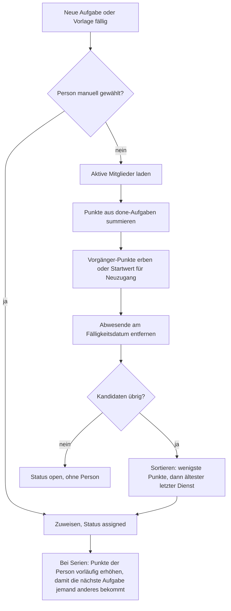

### „Fair neu zuweisen“ (`src/lib/tasks/reassign-actions.ts`)

Nur Admins. Nimmt Punkte inkl. Historie **und** manueller Ausgleiche, rechnet fixierte, offene Aufgaben als
geplante Last ein und verteilt alle nicht fixierten Aufgaben mit Status `open`, `assigned`, `overdue` nach
Fälligkeit neu. Dabei wird möglichst nicht zweimal hintereinander dieselbe Person gewählt; Tiebreaker ist die Zahl
bereits geplanter Dienste. Es werden keine Aufgaben erzeugt oder gelöscht.

### Einfluss des Wetters

Das Wetter **verändert keine Zuweisung**. `getWetterOnlineForecast` (WetterOnline-Scraping, bei Fehlern Open-Meteo,
Ergebnisse 1 h gecacht über `next: { revalidate: 3600 }`) liefert Tageswerte. `rateWeatherDayForTask` bewertet jeden
Tag je Aufgabentyp (Schnee, Gießen, Mähen, „trocken“, allgemein) mit einem Score 0–100, und
`formatWeatherRecommendation` hängt eine Empfehlung („Tag X wirkt am besten“) an Chat-Erinnerungen und
Übernahme-Aufrufe. Der Kalender (`/calendar`) zeigt Wettersymbole. Ort: `gardens.weather_location`, sonst Gartenname,
sonst `WETTERONLINE_LOCATION`.

---

## 9. Cron-Job

`GET /api/cron/garden-jobs` (`src/app/api/cron/garden-jobs/route.ts`) prüft `Authorization: Bearer <CRON_SECRET>`
(sonst 401), erzeugt den Admin-Client (sonst 500) und ruft `runGardenAutomation` (`src/lib/cron/garden-jobs.ts`) auf.
Antwort: `{ ok, gardens, createdTasks, createdNotifications, failedGardens }`.

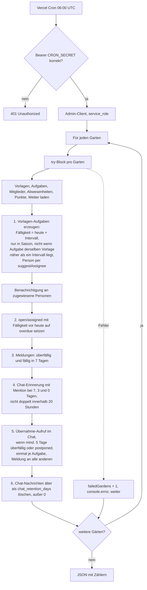

Details:
- **Fehlerisolation:** Jeder Garten läuft in einem eigenen `try/catch`. Ein Fehler in einem Garten stoppt die anderen nicht.
  Nicht-kritische Schritte (overdue markieren, Chat-Cleanup) loggen nur.
- **Doppel-Schutz:** Vorlagen-Aufgaben über `hasTemplateTaskWithinInterval`; Chat-Erinnerungen über
  `hasCronMessageForTask` (20-Stunden-Fenster); Übernahme-Aufrufe über `hasTakeoverCallForTask` (sucht eine
  `system_overdue`-Nachricht mit dem Text „Jede Person kann die Aufgabe“).
- Derselbe Erzeugungs-Algorithmus existiert als Knopf auf `/templates` (`generateSeasonalTasksAction`), ein
  vereinfachter Erinnerungslauf als Knopf auf `/notifications` (`createDueNotificationsAction`), und Admins können
  auf dem Dashboard pro Aufgabe eine Chat-Erinnerung bzw. einen Übernahme-Aufruf auslösen (`triggerTaskChatAutomationAction`).

---

## 10. Mitbewohner-Wechsel und Team-Abrechnung

Spezifikation: `docs/superpowers/specs/2026-09-23-mitbewohner-wechsel-design.md`. Umsetzung: Migrationen 019/020,
`src/lib/billing/teams.ts`, `src/lib/gardens/prepared-member-actions.ts`, `src/components/members/invite-panel.tsx`,
`src/app/billing/page.tsx`.

### Begriffe

| Begriff | Bedeutung | Datenfeld |
|---|---|---|
| Platz / Team | Eine „Stelle“ im Haushalt. Ersetzt B Person A, teilen beide denselben Platz. | `garden_members.slot_id` |
| Anwesenheit | Tage einer Mitgliedschaft im Zeitraum: `max(joined_on, Start)` bis `min(left_on, Ende)`, inklusive | `joined_on`, `left_on` |
| Zeitraum | Abrechnungsperiode vom letzten Abschluss bis zum nächsten (typisch März bis März) | `billing_periods` |

Ausgezogene Personen bleiben als `is_active = false` mit `left_on` in `garden_members`, damit sie in der Abrechnung bleiben.

### Einladungen mit E-Mail

Ist bei einer Einladung eine E-Mail eingetragen, prüft `accept_garden_invite` (Migration 022), dass die annehmende
Person genau mit dieser E-Mail angemeldet ist. Links ohne E-Mail kann jede angemeldete Person annehmen.

### Ersetzen: zwei Wege

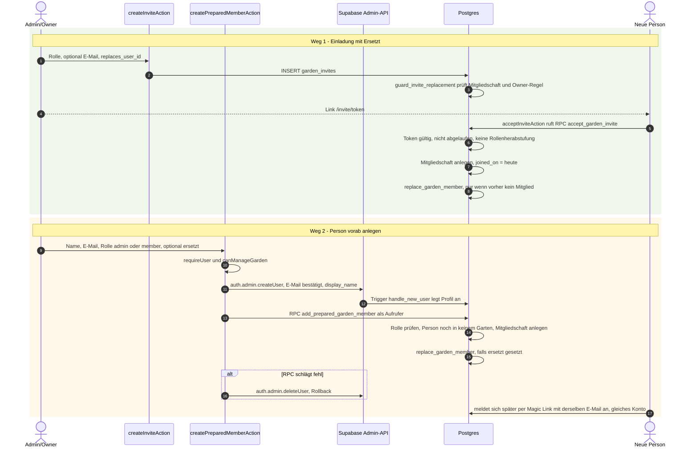

`replace_garden_member(garden, neu, alt)` (Stand 020) macht atomar:
1. Neue Mitgliedschaft übernimmt `slot_id` des Vorgängers, setzt `replaces_user_id`, `joined_on = heute`, `left_on = null`.
2. War der Vorgänger der **letzte aktive Owner**, wird die neue Person Owner (sonst würde der Trigger blockieren).
3. Vorgänger: `is_active = false`, `left_on = coalesce(left_on, gestern)`.
4. Offene Aufgaben (`open`, `assigned`, `overdue`, `postponed`) des Vorgängers gehen an die neue Person; `open` wird `assigned`.

Alle Datumswerte nach deutscher Zeit (`now() at time zone 'Europe/Berlin'`). Ohne Nachfolger kann ein Admin ein
Mitglied mit Auszugsdatum deaktivieren (`setMemberActiveAction`, Datum nicht in der Zukunft).

### Rechenweg (`calculateTeamBilling` in `src/lib/billing/teams.ts`)

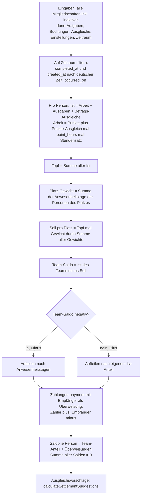

Regeln im Detail:
- `splitCents` verteilt Beträge cent-genau nach dem Größter-Rest-Verfahren; die Summe bleibt exakt erhalten.
- Eine Buchung vom Typ `expense` oder eine `payment` **ohne** Empfänger zählt als Ausgabe des Zahlers (in den Topf).
  Eine `payment` **mit** Empfänger ist eine Überweisung und gehört nicht in den Topf. `createTransactionAction` erzwingt
  seit 019 einen Empfänger ≠ Zahler für neue Zahlungen und lehnt Buchungen vor Beginn des offenen Zeitraums ab.
- Personen ohne Anwesenheit im Zeitraum bleiben nur drin, wenn sie Beiträge oder Buchungen im Zeitraum haben.
- Da `Σ Soll = Topf` und `Σ Ist = Topf`, ist `Σ Team-Salden = 0`; Überweisungen heben sich paarweise auf → Summe aller Salden = 0.

**Beispiel aus der Spezifikation (in Punkten, Soll pro Platz 60):**
Alt war 10 Monate da und hat 20 P., Neu 2 Monate mit 15 P. → Team 35 − 60 = **−25**.
Minus nach Anwesenheit: Neu 2/12 → **−4,2**, Alt 10/12 → **−20,8**.
(Unit-Test „team minus is split by presence time“ in `tests/unit/team-billing.test.mjs`.)

**Plus-Fall:** Team-Ist 80 gegen Soll 60 → +20. Alt hat 50 beigetragen, Neu 30 → Alt +12,5, Neu +7,5 (nach Beitrag, nicht nach Zeit).

**Beispiel in Euro mit Überweisung (1 Punkt = 1 h × 10 € Standard):**

| Person | Platz | Anwesenheit | Ist | Soll Platz | Team-Anteil | Überweisung | Saldo |
|---|---|---|---|---|---|---|---|
| Anna | A | 365 Tage | 700 € | 525 € | +175,00 € | −29,25 € (empfangen) | +145,75 € |
| Bernd | B | 304 Tage | 200 € | 525 € (Team B) | −145,75 € | – | −145,75 € |
| Clara | B | 61 Tage | 150 € | | −29,25 € | +29,25 € (an Anna gezahlt) | 0,00 € |
| **Summe** | | | 1050 € (Topf) | 1050 € | 0 € | 0 € | **0 €** |

Team B: 350 € − 525 € = −175 €, aufgeteilt 304 : 61 Tage.

### Abrechnungszeiträume

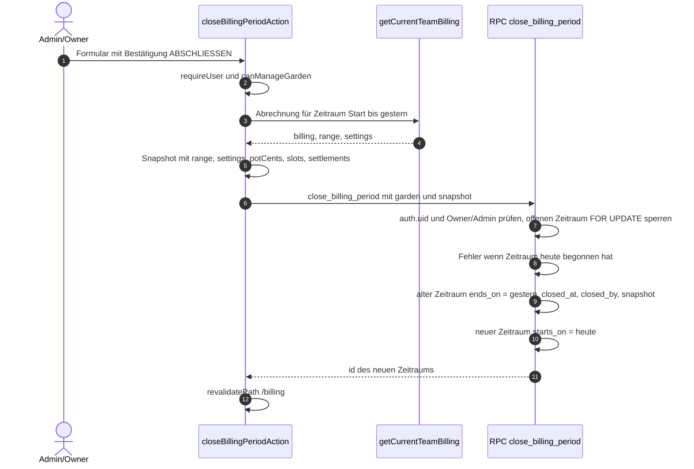

- Der erste Zeitraum beginnt am Tag der Gartenerstellung (Backfill in 019, Trigger für neue Gärten).
- Seit 020 endet der alte Zeitraum **gestern** und der neue beginnt **heute** – kein Tag fällt dazwischen.
  (Migration 019 hatte noch „endet heute, neuer ab morgen“.)
- Abgeschlossene Zeiträume sind nur noch als `snapshot` (JSON) im Archiv auf `/billing` lesbar.
- `billing_periods` hat nur eine Lese-Policy für Mitglieder; geschrieben wird ausschließlich über die RPC bzw. Trigger.

---

## 11. Benachrichtigungen

> Stand 2026-09-23: Der Cron schickt „überfällig“ und „bald fällig“ nur **einmal pro Dienst und Person** (Abgleich mit
> vorhandenen `notifications` in `src/lib/cron/garden-jobs.ts`). Chat-Erinnerungen 7/3/0 Tage vor Fälligkeit bleiben.

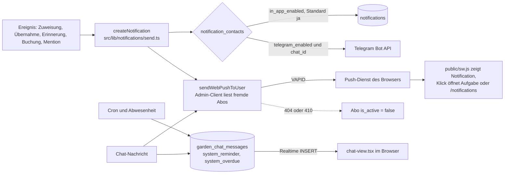

- **In-App:** Tabelle `notifications`; Seite `/notifications`, Badge in der Navigation (`getUnreadNotificationCount`).
  Lesen/Markieren nur eigene Meldungen (RLS `notifications read own`/`update own`).
- **Web Push:** Registrierung in `src/components/settings/web-push-panel.tsx` (registriert `/sw.js`, abonniert mit
  `NEXT_PUBLIC_WEB_PUSH_VAPID_PUBLIC_KEY`, speichert per `savePushSubscriptionAction`). Versand über `web-push` mit
  `setVapidDetails` (`src/lib/notifications/web-push.ts`). Ohne VAPID-Keys wird still nichts gesendet. Auf iOS nur als
  installierte PWA. Der Service Worker setzt `tag` pro URL, damit Meldungen nicht doppelt erscheinen.
- **Chat:** Gruppenchat je Garten (`/chat`). Nutzer schreiben nur `message_type = 'user'`; Systemnachrichten
  (`author_id = null`) schreibt nur der Server mit Admin-Client (`insertSystemChatMessage`). Erwähnte Personen bekommen
  Meldung + Push, alle anderen nur Push (`sendChatMessageAction`). Private Systemnachrichten sind über
  `visible_to_user_id` per RLS und zusätzlich clientseitig gefiltert. Ungelesen-Zähler über `last_chat_read_at`
  (gesetzt von `markChatReadAction`). Aufbewahrung: `chat_retention_days`, Löschung durch den Cron.
- **Realtime:** Migration 014 fügt `garden_chat_messages` zur Publikation `supabase_realtime` hinzu; `chat-view.tsx`
  abonniert `INSERT`-Events mit Filter `garden_id=eq.<id>`. Supabase wendet dabei die Lese-Policy an.
- **Telegram** (optional) und **WhatsApp** (nur als Kontaktangabe gespeichert) über `notification_contacts`.

---

## 12. Querschnittsthemen

### Sicherheits-Checkliste (Stand des Codes)

| Punkt aus `.claude/rules/04-security.md` | Status |
|---|---|
| Alle Server Actions beginnen mit `requireUser()` | ✓ erfüllt (alle `actions.ts`, auch `markChatReadAction`, Push-Actions) |
| SQL-Funktionen prüfen `auth.uid() is null` zuerst | ✓ bei allen aufrufbaren RPCs; `replace_garden_member` ist nicht aufrufbar (execute entzogen) |
| SQL-Funktionen prüfen Berechtigungen | ✓ |
| Keine String-SQL | ✓ nur Supabase-Client. Ausnahme zum Beobachten: `.or(...)` mit interpolierter `gardenId`/`userId` in `getTaskTemplates` und `getUnreadChatCount` (Werte stammen aus der Session bzw. DB) |
| Kein Admin-Client in normalen User-Flows | ⚠ teilweise: Admin-Client wird genutzt in `createAvailabilityAction` (Aufgaben auf `postponed`, Systemnachricht), `sendChatMessageAction` und `createNotification` (Meldungen für andere anlegen – RLS erlaubt seit 021 nur eigene –, fremde Push-Abos lesen), `markChatReadAction` (keine Self-Update-Policy), `createPreparedMemberAction` (Konto anlegen) und `triggerTaskChatAutomationAction` (Admin-only). Jeweils nach Login- und teils Rollenprüfung |
| Keine Secrets in `NEXT_PUBLIC_` | ✓ |
| RLS auf allen Tabellen | ✓ alle 20 Tabellen |
| Security-Definer mit eigener Prüfung | ✓; Guard-Trigger bewusst als security invoker |
| Owner-Schutz | ✓ Trigger `prevent_last_owner_loss` + Guard 018 + App-Prüfung |
| Offene Redirects | ✓ `next` wird in Callback und Login-Formular validiert |
| Cron geschützt | ✓ Bearer `CRON_SECRET` |

### Fehlerbehandlung

- **Queries** (`src/lib/*/queries.ts`): `console.error("<funktion>", error.message)` und sicherer Rückgabewert (`[]`/`null`,
  bei Einstellungen Standardwerte). Die Seite rendert dann leer statt abzustürzen.
- **Server Actions:** Jede Action mit `FormData` läuft in `runAction()` (`src/lib/actions/run-action.ts`). Fehler werden
  als `{ error }` zurückgegeben, bekannte Datenbank-Meldungen (z. B. „A garden must keep at least one active owner“)
  in verständliches Deutsch übersetzt; `redirect()` wird als `{ redirectTo }` weitergereicht. Next.js würde geworfene
  Meldungen in Produktion verschlucken und eine generische Fehlerseite zeigen, deshalb wird nicht mehr geworfen.
- **Formulare:** `ActionForm` (`src/components/ui/action-form.tsx`, Client Component) sendet ohne das automatische
  Zurücksetzen von React, zeigt Fehler rot direkt am Formular, kurz „✓ Gespeichert“ bei Erfolg und navigiert bei
  `redirectTo`. Der `Button` zeigt währenddessen einen Kreisel (über `useActionPending`).
- **Protokoll-Schreibvorgänge** (`task_events`, Benachrichtigungen) werden meist ohne Fehlerprüfung ausgeführt – ein
  fehlgeschlagener Log-Eintrag bricht die eigentliche Aktion nicht ab.
- **Cron:** Fehler pro Garten gefangen und gezählt (`failedGardens`).
- **Externe Dienste:** Wetter mit 6-s-Timeout und Fallback; Telegram- und Push-Fehler werden geloggt; abgelaufene
  Push-Abos (404/410) deaktiviert.

### Zeitzonen

Der Haushalt lebt in Deutschland, Server und Datenbank laufen in UTC.

| Helfer | Datei | Verhalten |
|---|---|---|
| `todayIsoDate()` | `src/lib/format/date.ts` | Heutiges Datum in `Europe/Berlin` (`Intl.DateTimeFormat("sv-SE", { timeZone })`) |
| `formatDateTime()` | `src/lib/format/date.ts` | Zeitstempel → `TT.MM.JJJJ, HH:MM` in deutscher Zeit |
| `formatDate()` | `src/lib/format/date.ts` | reines Datum → `TT.MM.JJJJ`, ohne Zeitzonen-Umrechnung |
| `addDaysIso()` | `src/lib/format/date.ts` | Datumsarithmetik in UTC auf ISO-Datumsstrings |
| `localDate()` | `src/lib/billing/teams.ts` | ordnet `completed_at`/`created_at` dem deutschen Kalendertag zu |
| SQL | Migrationen 019/020 | `(now() at time zone 'Europe/Berlin')::date` für `joined_on`, `left_on`, Zeiträume |

`due_date`, `from_date`/`to_date`, `occurred_on` sind reine Datumswerte ohne Zeitzone. Unit-Tests in
`tests/unit/scheduling.test.mjs` sichern `todayIsoDate` und `formatDateTime` ab.

### Tests

`npm run test:unit` / `npm run test:integration` / `npm test` (Node Test Runner mit `--experimental-strip-types`,
importiert TypeScript-Quellen direkt).

| Datei | Prüft |
|---|---|
| `tests/unit/team-billing.test.mjs` | `presenceDays`, `splitCents`, Spec-Beispiel, Plus-Fall, Summe 0, später dazugekommener Platz, Zeitraum-Filter, Kette A→B→C, Zahlung ohne Empfänger, Ausgezogene mit Beiträgen |
| `tests/unit/membership-scores.test.mjs` | Punkte-Erbe, Startwert für Neuzugänge, nur neuestes aktives Mitglied erbt |
| `tests/unit/scheduling.test.mjs` | `hasTemplateTaskWithinInterval`, deutsche Zeit in `todayIsoDate`/`formatDateTime` |
| `tests/unit/weather.test.mjs` | Wetter-Bewertung (Schnee, Regen beim Mähen), Symbole |
| `tests/integration/weather-fetch.test.mjs` | echter Abruf für „Murnau am Staffelsee“ (braucht Internet) |

Zusätzlich wurden am 2026-09-23 alle Seiten (3 Rollen × Handy/Desktop, inkl. Prüfung auf seitliches Scrollen) und
28 Abläufe (Erledigen, Übernehmen, Kommentieren, Abwesenheit, Abrechnung, Einladung mit Ersetzen, Vorab-Anlegen,
Auszug, Abschluss, Cron) per Browser-Automation gegen eine lokale Supabase-Instanz mit allen Migrationen getestet.
Diese Skripte liegen unter `tests/e2e/` (`npm run test:e2e`, Anleitung in `tests/e2e/README.md`) und laufen nur gegen
eine lokale Supabase (Schutz in `tests/e2e/env.mjs`). Sie decken Server Actions, RLS, RPCs und Trigger über die echte
Oberfläche ab. Diese werden nach der Checkliste in
`.claude/rules/06-testing.md` manuell gegen Supabase getestet. Vor jedem Commit laufen zusätzlich
`npm run typecheck` und `npm run build`.

### Migrations-Workflow

1. Neue Datei `supabase/migrations/NNN_thema.sql`, fortlaufend nummeriert (nächste: `024_…`).
2. Additiv und idempotent: `create … if not exists`, `create or replace function`, `drop trigger if exists` vor `create trigger`,
   `grant`/`revoke execute` nach jeder Funktion.
3. `src/types/database.ts` (Tabellen und `Functions`) anpassen.
4. Migration **manuell** im Supabase SQL Editor ausführen – vor oder zusammen mit dem Code-Deploy.
5. Bei Änderungen an Beziehungen: `notify pgrst, 'reload schema';` (wie in 020), damit PostgREST das Schema neu lädt.

### Bekannte Grenzen und Tech-Debt

- **Duplizierter Code:** `readString` in fast jeder Action-Datei; die Kandidaten-Rangliste für Übernahmen existiert
  dreimal (`src/lib/cron/garden-jobs.ts`, `src/lib/availability/actions.ts`, `src/lib/tasks/reminder-actions.ts`),
  die Vorlagen-Erzeugung zweimal (Cron und `generateSeasonalTasksAction`).
- **Nicht-atomare Mehrschritt-Actions:** z. B. Übernahme-Anfrage wird als `approved` gespeichert, bevor das Task-Update
  (evtl. am Guard-Trigger) scheitert; Event- und Benachrichtigungs-Inserts sind nicht transaktional.
- **Punktbasis:** Für die Verteilung gilt überall `getRankingScores()` (`src/lib/planning/ranking.ts`): eigene Punkte +
  Vorgänger-Historie + Korrekturen. Das Rennen auf der Übersicht zeigt bewusst nur selbst erledigte Punkte.
- **Leistung:** Seiten laden alle Aufgaben eines Gartens ohne Paging; der Cron sendet Benachrichtigungen einzeln (N+1)
  und ruft das Wetter für jeden Garten ab. Für einen Haushalt unkritisch.
- **Einfacher Wortfilter** statt echter Moderation; **WhatsApp** nur als Kontaktfeld.
- **Doku-Drift:** `docs/planning-algorithm.md` und `docs/database-schema.md` beschreiben teilweise noch den
  abgeschafften `pending_review`-Prüfschritt bzw. nur Migration 001.
- **`pending_review`** bleibt als toter Enum-Wert erhalten.
