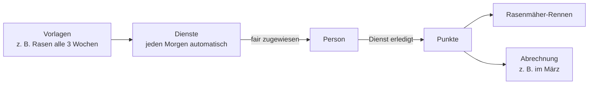
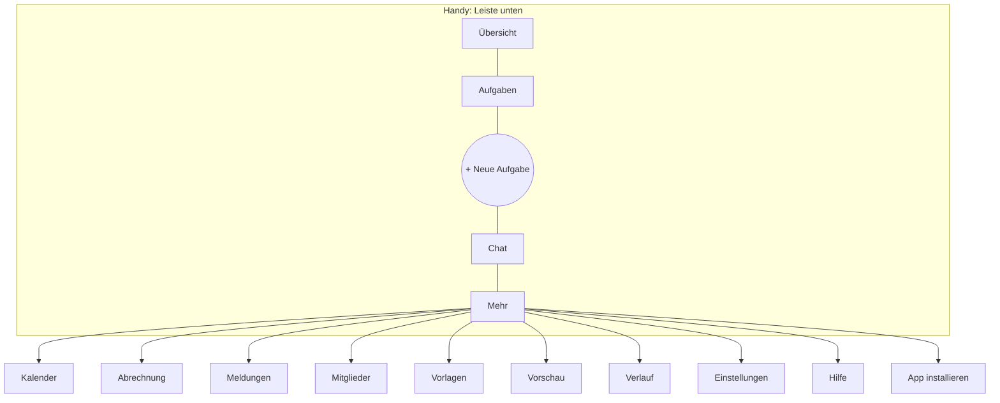
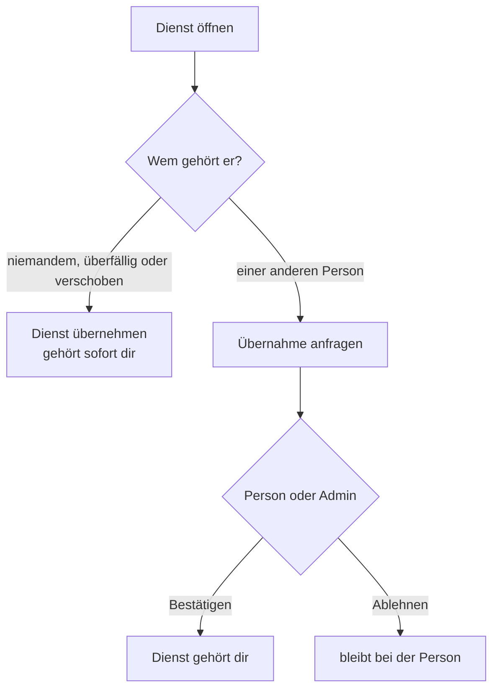
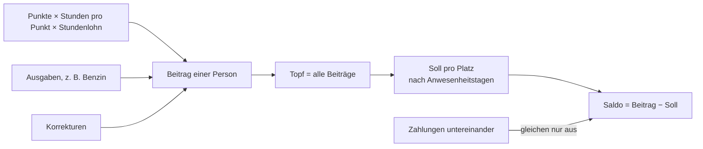
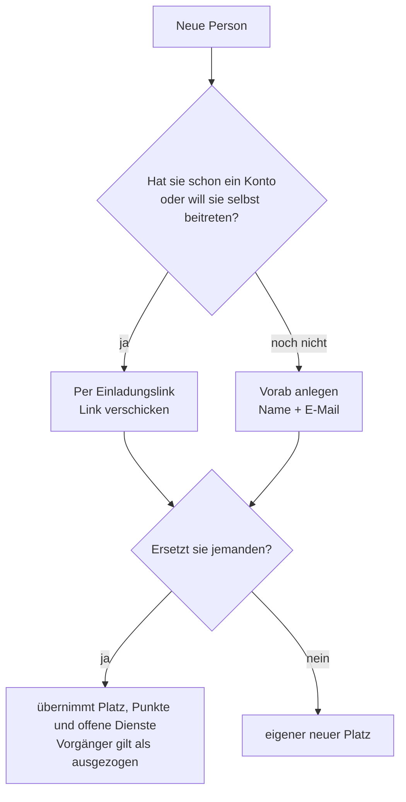

# Benutzerhandbuch Garten Dienstplan

Dieses Handbuch erklärt alles, was du in der App machen kannst: für **Mitglieder**, **Admins** und **Owner**.
In der App selbst findest du dieselben Anleitungen unter **Mehr → Hilfe**, dort mit Suche und automatisch passend zu deiner Rolle.

> Tipp: Mit `Strg+F` (Mac: `⌘+F`) findest du hier jedes Stichwort, z. B. „Urlaub“, „Abrechnung“ oder „einladen“.

## Inhalt

1. [Die Idee in einem Satz](#1-die-idee-in-einem-satz)
2. [Rollen: Wer darf was?](#2-rollen-wer-darf-was)
3. [Erste Schritte](#3-erste-schritte)
4. [Navigation](#4-navigation)
5. [Dienste erledigen, übernehmen, anlegen](#5-dienste)
6. [Punkte und Fairness](#6-punkte-und-fairness)
7. [Kalender, Abwesenheit, Vorschau](#7-kalender-abwesenheit-vorschau)
8. [Chat und Meldungen](#8-chat-und-meldungen)
9. [Abrechnung](#9-abrechnung)
10. [Mitglieder verwalten (Admin/Owner)](#10-mitglieder-verwalten)
11. [Planung und Vorlagen (Admin/Owner)](#11-planung-und-vorlagen)
12. [Einstellungen](#12-einstellungen)
13. [Häufige Fragen](#13-häufige-fragen)
14. [Wenn etwas nicht klappt](#14-wenn-etwas-nicht-klappt)

---

## 1. Die Idee in einem Satz

Alle im Haushalt teilen sich die Gartenarbeit. Jeder erledigte Dienst bringt Punkte, die App verteilt neue Dienste fair, und einmal im Jahr (meist im März) wird mit den Nebenkosten abgerechnet, wer mehr oder weniger beigetragen hat.

## 2. Rollen: Wer darf was?

| Funktion | Mitglied | Admin | Owner |
|---|:-:|:-:|:-:|
| Eigene Dienste erledigen, Dienste übernehmen, Kommentare, Chat | ✅ | ✅ | ✅ |
| Neue Aufgabe anlegen, Abwesenheit eintragen, Ausgaben/Zahlungen eintragen | ✅ | ✅ | ✅ |
| Eigene Dienste fest einloggen | ✅ | ✅ | ✅ |
| Übernahme-Anfragen bestätigen | nur für eigene Dienste | ✅ | ✅ |
| Erledigung zurücknehmen, Aufgaben löschen/wiederherstellen, fair neu verteilen | – | ✅ | ✅ |
| Erledigte Aufgaben nachtragen | – | ✅ | ✅ |
| Vorlagen, Saisonaufgaben, Wetterort, Chat-Aufbewahrung, Gartenname | – | ✅ | ✅ |
| Mitglieder einladen, vorab anlegen, Auszug/Einzug eintragen, Rollen (bis Admin) | – | ✅ | ✅ |
| Punktwert, Korrekturen, Abrechnung abschließen | – | ✅ | ✅ |
| Owner-Rechte vergeben/entziehen, einen Owner ersetzen | – | ✅ | ✅ |
| Garten löschen | – | ✅ | ✅ |

> **Admin und Owner dürfen alles.** Der einzige Unterschied: Ein Garten braucht immer mindestens einen aktiven Owner. Der letzte Owner kann weder herabgestuft werden noch austreten. Zieht er aus, ersetzt man ihn per Einladung, dann wird der Nachfolger automatisch Owner.

## 3. Erste Schritte

### Anmelden
1. Seite öffnen und **E-Mail** eingeben.
2. Entweder **Magic Link** anfordern und den Link aus der E-Mail öffnen, oder unter **Login** mit Passwort anmelden.
3. Du landest auf der **Übersicht**.

### Einladung annehmen
1. Einladungslink öffnen.
2. Anmelden (oder Konto anlegen).
3. **Einladung annehmen** klicken.

Wenn die Einladung „ersetzt Person X“ enthält, übernimmst du automatisch X' Platz, Punkte und offene Dienste (siehe [Abrechnung](#95-team-abrechnung-beim-mitbewohner-wechsel)).

### Du wurdest vorab angelegt?
Ein Admin kann dich schon eintragen, bevor du die App nutzt. Melde dich einfach mit **genau der E-Mail** an, die der Admin eingetragen hat, am einfachsten per Magic Link. Deine Dienste und Punkte sind dann schon da.

### App auf dem Handy installieren
**Mehr → App installieren**:
- **iPhone/iPad:** In Safari auf *Teilen* → *Zum Home-Bildschirm*.
- **Android:** Menü → *App installieren*.
Danach unter **Einstellungen → Web Push** Benachrichtigungen aktivieren. Beim iPhone geht das nur, wenn die App auf dem Home-Bildschirm liegt.

## 4. Navigation

- **Desktop:** oben Übersicht, Aufgaben, Chat, Kalender, Abrechnung und **Mehr**. Rechts der Knopf **+ Aufgabe**.
- **Glocke** oben rechts: neue Meldungen, mit Zähler.
- Jeder Knopf gibt beim Drücken leicht nach. Solange eine Aktion läuft, zeigt er einen kleinen Kreisel. Wenn etwas nicht erlaubt ist, erscheint direkt am Formular ein roter Hinweis mit dem Grund.

## 5. Dienste

### 5.1 Dienst erledigt melden
1. Auf der **Übersicht** steht oben dein nächster Dienst, alternativ unter **Aufgaben**.
2. **Dienst erledigt** klicken. Die Punkte zählen sofort, es braucht keine Bestätigung.

Zeitfenster: Normale Dienste lassen sich **7 Tage vor bis 7 Tage nach** dem Fälligkeitsdatum erledigen. **Überfällige** und **verschobene** Dienste gehen jederzeit.

### 5.2 Dienst übernehmen

### 5.3 Dienst fest einloggen
Bei einem eigenen Dienst **Diesen Dienst fest einloggen** klicken. Dann wird er bei „Fair neu zuweisen“ nicht verschoben. Lösen können nur Admins und Owner.

### 5.4 Neue Aufgabe anlegen
**+** (Handy) bzw. **+ Aufgabe** (Desktop):
1. Optional eine **Vorlage** wählen, sonst Titel, Punkte (1–5) und Fälligkeit eintragen.
2. **Zuweisung** leer lassen, dann schlägt die App die fairste Person vor.
3. **Aufgabe erstellen**.

### 5.5 Kommentare
Im Dienst unten Kommentar schreiben → **Kommentar speichern**. Im Abschnitt „Verlauf“ der Aufgabe siehst du, wer wann was geändert hat.

### 5.6 Für Admins und Owner
| Aktion | Wo | Hinweis |
|---|---|---|
| Erledigte Aufgabe nachtragen | Neue Aufgabe → unten | Für Arbeit, die schon passiert ist; Datum frei wählbar |
| Erledigung zurücknehmen | Aufgabe → Grund → *Erledigung rückgängig* | Punkte werden abgezogen |
| In Papierkorb / Wiederherstellen | Aufgabe | Gelöschte Aufgaben zählen nicht |
| Fair neu zuweisen | Aufgaben | Verteilt offene, nicht fixierte Dienste neu |

## 6. Punkte und Fairness

- Jeder erledigte Dienst bringt 1–5 Punkte.
- Das **Rasenmäher-Rennen** auf der Übersicht zeigt, wer wie viel „gemäht“ hat. Der Führende hat die wehende Zielfahne.
- **Fair heißt:** Neue Dienste bekommt bevorzugt, wer die wenigsten Punkte hat und im Zeitraum nicht abwesend ist.
- **Nachfolger** starten mit den Punkten ihres Vorgängers, damit sie nicht plötzlich alle Dienste bekommen.
- Wer **zusätzlich einzieht**, bekommt einen fairen Startwert: so, als wäre er von Anfang an mit durchschnittlichem Tempo dabei gewesen.

Im Rennen stehen immer die echten, selbst erledigten Punkte. Der Startwert zählt nur intern für die Verteilung.

## 7. Kalender, Abwesenheit, Vorschau

### Abwesenheit (Urlaub, krank …)
**Mehr → Einstellungen → Abwesenheit eintragen:** Von, Bis, optional Grund → **Speichern**.
Deine Dienste in diesem Zeitraum werden **verschoben** und im Chat zur Übernahme angeboten. Die Fairness berücksichtigt deine Abwesenheit.

### Kalender
Monatsübersicht mit Diensten, Abwesenheiten und **Wetter**. Das Wetter kommt von WetterOnline, ersatzweise von Open-Meteo. Bei wetterabhängigen Diensten wie Rasenmähen gibt die App Empfehlungen.

### Vorschau
**Mehr → Vorschau** zeigt, welche Dienste in den nächsten 3 Monaten aus den Vorlagen entstehen und wer voraussichtlich dran ist. Mit **Einloggen** übernimmst du einen Vorschlag für dich fest.

## 8. Chat und Meldungen

- **Chat:** Nachricht schreiben, Enter sendet. Mit **@Name** erwähnst du jemanden, die Person bekommt eine Meldung.
- Die App schreibt selbst in den Chat: Erinnerungen **7, 3 und 0 Tage** vor Fälligkeit und Übernahme-Aufrufe, wenn ein Dienst **5 Tage überfällig** oder verschoben ist.
- Die Meldungen „bald fällig“ und „überfällig“ bekommst du pro Dienst nur **einmal**, nicht jeden Tag neu.
- **Meldungen** (Glocke): Zuweisungen, Erinnerungen, Übernahme-Anfragen, Zahlungen. **Gelesen** markiert sie.
- **Push/Telegram:** unter Einstellungen aktivieren.

## 9. Abrechnung

### 9.1 Dein Stand
Ganz oben auf **Mehr → Abrechnung** steht groß **Dein Stand**:
- **Plus** = du hast mehr beigetragen als dein Anteil und bekommst Geld.
- **Minus** = du liegst unter deinem Anteil und zahlst beim Ausgleich.
Darunter stehen deine **Ausgleichszahlungen** („Du zahlst an …“).

### 9.2 Wie wird gerechnet?

Alle Salden zusammen ergeben immer genau 0 €.

### 9.3 Ausgabe oder Zahlung eintragen
1. **Ausgabe** (du hast etwas für den Garten bezahlt) oder **Zahlung an jemanden** (Ausgleich zwischen euch) wählen.
2. Wofür, Betrag, Datum. Bei einer Zahlung den **Empfänger** wählen.
3. **Eintragen**.

Buchungen vor dem Beginn des laufenden Zeitraums gehen nicht, weil dieser Zeitraum schon abgerechnet ist.

### 9.4 Plätze im Haushalt
Jede Person hat einen **Platz**. Pro Platz siehst du einen Balken: Beitrag im Vergleich zum Soll (schwarzer Strich). Grün heißt über dem Soll, gelb darunter.
Darunter steht pro Person die Rechnung, z. B. „12 Punkte = 120,00 €“ oder „5 Punkte (9 erledigt, Korrektur −4) = 50,00 €“, dazu Ausgaben und Zahlungen.

### 9.5 Team-Abrechnung beim Mitbewohner-Wechsel
Wer jemanden **ersetzt**, teilt sich mit ihm den Platz und bildet ein **Team**:
- **Team im Minus:** Das Minus wird nach **Anwesenheitstagen** geteilt.
- **Team im Plus:** Das Plus wird nach **eigenem Beitrag** verteilt.

**Beispiel:** Soll pro Platz 60 Punkte. Alt war 10 Monate da und hat 20 Punkte gemacht, Neu war 2 Monate da und hat 15 Punkte gemacht. Das Team hat 35 − 60 = **−25**. Neu trägt davon 2/12 ≈ **−4,2**, Alt 10/12 ≈ **−20,8**.

Wer ohne Nachfolger auszieht, bleibt mit seinen Anwesenheitstagen bis zum Abschluss in der Abrechnung.

### 9.6 Für Admins und Owner: Verwaltung
Unter **Verwaltung** (aufklappen):
- **Wert eines Punktes:** Stundenlohn und Stunden pro Punkt.
- **Korrektur eintragen:** Punkte oder Betrag für eine Person, z. B. Startwert beim Einzug. Korrekturen zählen auch für die faire Verteilung neuer Dienste.
- **Korrektur löschen:** unter *Verlauf in diesem Zeitraum* bei der Korrektur auf **Löschen**, z. B. bei doppelten Einträgen.
- **Abrechnung abschließen:** `ABSCHLIESSEN` eintippen und bestätigen. Das Ergebnis **bis gestern** wird im Archiv gespeichert (**Frühere Abrechnungen**), ab heute läuft ein neuer Zeitraum. Das lässt sich nicht rückgängig machen.

## 10. Mitglieder verwalten

**Mehr → Mitglieder** ist in drei Bereiche gegliedert: **Wohnt hier**, **Ausgezogen** und **Neue Person**.

| Aufgabe | So geht's |
|---|---|
| Einladen | *Per Einladungslink* → Ersetzt wählen → **Link erstellen** → Link aus *Offene Einladungen* kopieren. Mit eingetragener E-Mail funktioniert der Link **nur für diese E-Mail**. |
| Vorab anlegen | *Vorab anlegen* → Name, E-Mail, optional Ersetzt → **Person anlegen** |
| Auszug | Person → *Bearbeiten* → Auszugsdatum → **Als ausgezogen markieren**. Ihre offenen Dienste werden frei. |
| Einzugsdatum korrigieren | Person → *Bearbeiten* → **Eingezogen am** → speichern (bei Ausgezogenen: *Daten korrigieren*) |
| Wieder aktivieren | Bei Ausgezogen → **Wieder aktivieren** |
| Rolle ändern | Person → *Bearbeiten* → Rolle → **Rolle speichern** |

**Owner übergeben oder ersetzen** (Admins und Owner): Zur Übergabe zuerst die neue Person zum Owner machen, danach die alte Owner-Rolle herabsetzen. Zieht der Owner aus, eine Einladung mit „Ersetzt: bisheriger Owner“ erstellen. Der Nachfolger wird automatisch Owner.

> Das **Einzugsdatum** bestimmt den Anteil an der Abrechnung. Wer von Anfang an dabei war, sollte das Datum des Zeitraumbeginns haben.

## 11. Planung und Vorlagen

- **Mehr → Vorlagen:** wiederkehrende Dienste mit Punkten, Saison (z. B. März–Oktober), Wiederholung und „wetterabhängig“.
- Jeden Morgen um 08:00 Uhr (06:00 UTC) legt die App daraus automatisch neue Dienste an, verteilt sie fair, markiert Überfälliges und verschickt Erinnerungen.
- **Saisonaufgaben erzeugen** legt sofort die nächsten Dienste an. Doppelte werden vermieden.
- **Chat-Erinnerung testen** (Übersicht, aufklappbar) löst für die nächsten Dienste testweise eine Erinnerung im Chat aus.

## 12. Einstellungen

| Einstellung | Wer | Wo |
|---|---|---|
| Anzeigename | alle | Mein Anzeigename |
| Abwesenheit | alle | Abwesenheit eintragen |
| Push / Telegram | alle | Web Push, Benachrichtigungen |
| Gartenname | Admin/Owner | Gartenname |
| Wetterort | Admin/Owner | Wetter, z. B. „Murnau am Staffelsee“ |
| Chat-Aufbewahrung | Admin/Owner | Chat-Einstellungen |
| Garten verlassen | alle außer letzter Owner | Gefahrenzone |
| Garten löschen | Admin/Owner | Gefahrenzone, mit „LOESCHEN“ bestätigen (löscht alles endgültig) |

**Garten verlassen:** Du wirst als ausgezogen geführt, deine offenen Dienste werden frei und du bleibst bis zum Abschluss in der Abrechnung.

## 13. Häufige Fragen

**Warum bekomme ich schon wieder einen Dienst?**
Du hast gerade die wenigsten Punkte oder die anderen sind abwesend. Im Rennen siehst du den Stand.

**Ich habe einen Dienst vergessen abzuhaken.**
Überfällige Dienste kannst du jederzeit erledigen. Liegt es länger zurück, kann ein Admin ihn als *erledigte Aufgabe nachtragen*.

**Ich habe aus Versehen „erledigt“ gedrückt.**
Ein Admin oder Owner kann die Erledigung zurücknehmen.

**Ein neuer Mitbewohner zieht ein. Was ist zu tun?**
Admin: Einladung mit „Ersetzt: alte Person“ erstellen (oder vorab anlegen). Den Rest macht die App.

**Jemand war von Anfang an da, steht aber mit späterem Einzug drin.**
Admin: Mitglieder → Bearbeiten → **Eingezogen am** korrigieren.

**Warum hat jemand in der Abrechnung so viel mehr oder weniger?**
Die Zeile unter dem Namen zeigt die Rechnung: Punkte, Korrekturen, Ausgaben. Häufige Ursache sind doppelte Korrekturen, z. B. durch einen Doppelklick. Ein Admin löscht sie unter „Verlauf in diesem Zeitraum“. Außerdem prüfen: Zählen die Dienste im laufenden Zeitraum? Stimmt das Einzugsdatum?

**Die Einladung sagt „gilt für eine andere E-Mail-Adresse“.**
Der Link wurde für eine bestimmte E-Mail erstellt. Melde dich mit genau dieser E-Mail an oder lass dir einen Link ohne E-Mail schicken.

**Ich sehe keinen Garten mehr.**
Du bist vermutlich als ausgezogen markiert. Ein Admin kann dich unter Mitglieder wieder aktivieren, oder du nimmst eine neue Einladung an.

## 14. Wenn etwas nicht klappt

| Problem | Lösung |
|---|---|
| Roter Hinweis unter einem Formular | Er nennt den Grund, z. B. fehlende Rechte oder „der letzte Owner kann nicht herabgestuft werden“. |
| Magic Link kommt nicht an | Spam-Ordner prüfen. Link auf demselben Gerät öffnen. |
| Keine Push-Nachrichten | App auf den Startbildschirm legen und in den Einstellungen Push aktivieren. Beim iPhone mindestens iOS 16.4. |
| Seite lädt ewig | Neu laden. Bei Offline-Verbindung zeigt die App den Rasenmäher-Ladebildschirm. |
| Wetter fehlt | Admin: Wetterort unter Einstellungen prüfen. |
